# Orion PTT System CloudFormation Installer

This installation method will leverage [CloudFormation](https://aws.amazon.com/cloudformation/) to create a Kubernetes Cluster on Amazon EC2 together with Security Groups and Load Balancers sufficient to enable access from the internet to the Orion PTT System.

## Architecture Diagram

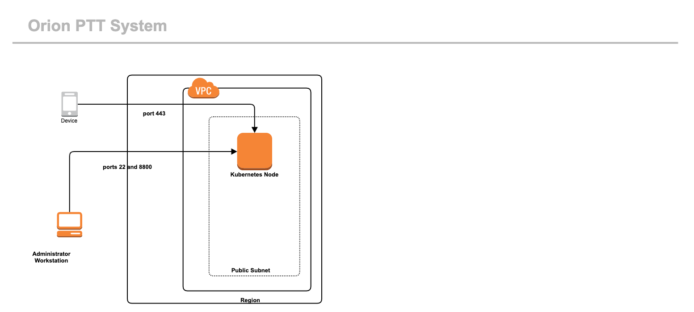

The Orion PTT System runs on a single Node Kubernetes Cluster.  Additional Nodes can be added to enable High Availability, or to enable large organizations, but for most users a single Node will suffice.

## AWS Resource Summary

The following AWS resources are required for a minimally functional Orion PTT System.  You can easily expand your cluster by adding additional EC2 instances as Kubernetes Nodes at a later time, and ensuring that the new instances are included in the Load Balancers, and have the appropriate Security Groups applied to them.

### EC2 Instances

Total: 1 Required

Purpose:

* 1 x m5.xlarge to serve as a single Kubernetes Node

### IAM Roles

Number: 1

Purpose: Creation of the AWS Components

### Security Groups

Number: 3

Purpose:  Determine allowable inbound traffic for each of the following:

* Kubernetes Node (Ports 22, 80, 443, 8800)

## Prerequisites for CloudFormation

### AWS Account

CloudFormation is an AWS service and access to an AWS account is required for running the CloudFormation script.

### IAM Role With Enough Permission to Create EC2 Instances and IAM Roles

The scripts must be run using a customized IAM role. Instructions for creating this IAM Role are documented in [Create IAM Role](#create-iam-role-for-cloudformation) below.

Additional Amazon documentation is available here: https://docs.aws.amazon.com/IAM/latest/UserGuide/introduction.html

### AWS VPC

An AWS VPC needs to be available in the AWS region (N. Virginia, us-east1) where the CloudFormation script will be run.

https://docs.aws.amazon.com/vpc/latest/userguide/what-is-amazon-vpc.html

VPCs need to be provisioned with networks. The Orion stack has very few components. You can easily run the Orion stack inside an existing VPC, or stand up a new one at your discretion.

### Two Public Subnets

The Orion stack needs two public subnets (where components in the subnet should be directly reachable from the internet) in the AWS VPC. The public subnets will be used to launch the internet facing components like AWS ELB.

https://docs.aws.amazon.com/vpc/latest/userguide/working-with-vpcs.html

The default subnets built by the VPC wizard are /24 networks with 254 IP addresses available within them.  This default is perfectly acceptable.

### SSH Key Pair

An SSH key pair must be created in the AWS region in which the CloudFormation script will run. This SSH key will be associated with all the EC2 instances launched by the CloudFormation script.

https://docs.aws.amazon.com/AWSEC2/latest/UserGuide/ec2-key-pairs.html

### Orion License

This is the license received from Orion when purchased.

## Pre Deployment Setup

### Set Region

Set your region to "us-east-1".

To check the current region, look for the region list on the upper right side of the navigation bar. The region will need to be set to N. Virginia (us-east-1).

If the region is not set to N. Virgina, drop down the menu and select the correct region.

### Create IAM role for CloudFormation

Search for IAM on AWS.

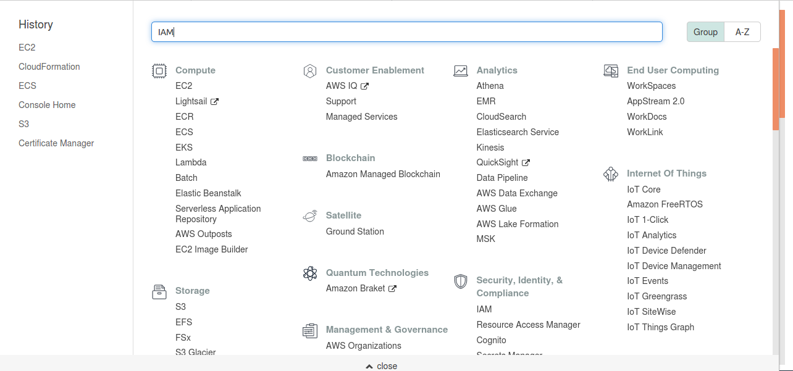

Choose the Roles tab on the IAM and click Create role.

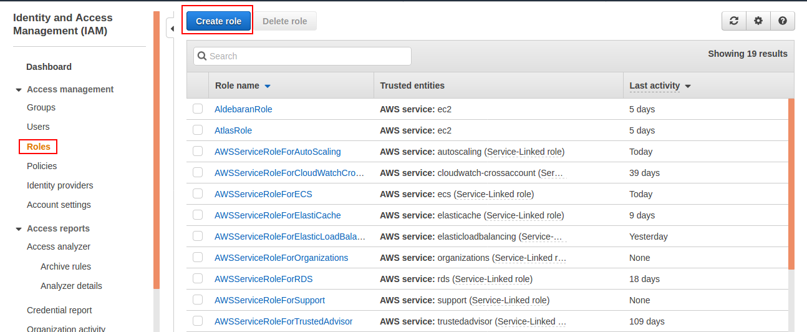

Specify CloudFormation as the service (entity) which is going to assume the role, then click Next: Permissions.

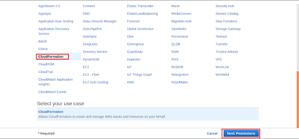

Now attach the below mentioned policies to the role:

* AmazonEC2FullAccess

* IAMFullAccess

All the above mentioned policies are AWS managed, you can look for them in the policy search bar and select them.

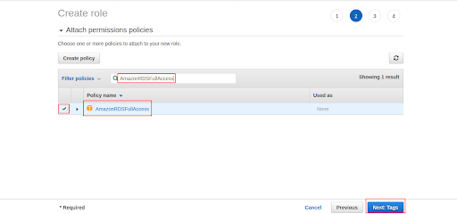

Now you can attach the tags (key-value pairs) of your choice.

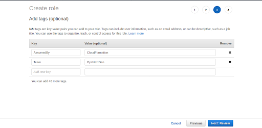

Now provide a name of your choice to the role (example: Orion-CFExecutionRole), verify that it has all the policies listed in step 2.3.4 and choose Create role.

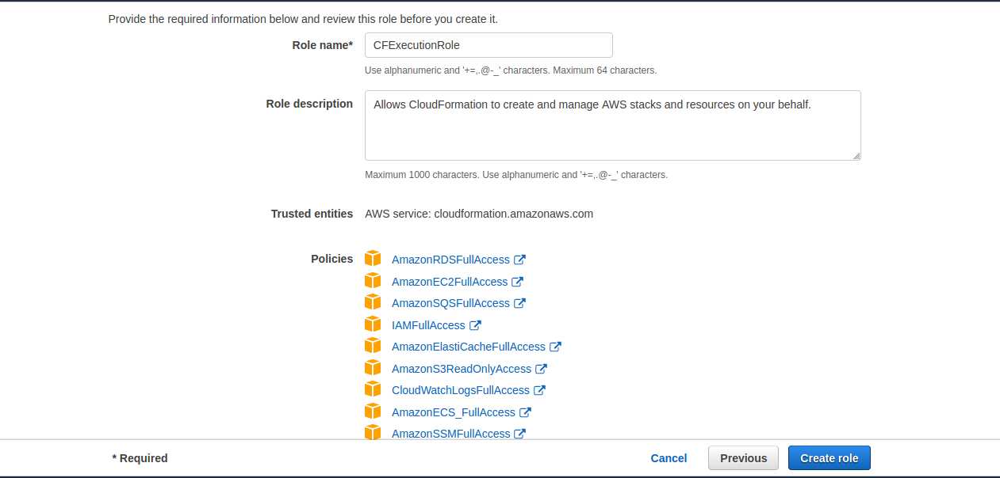

## CloudFormation Deployment

Log in to your AWS account and search for CloudFormation.

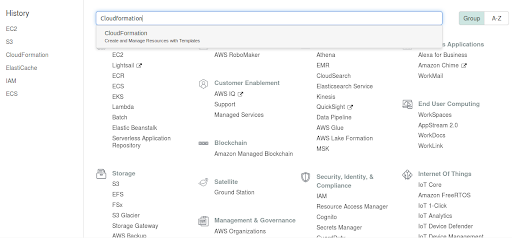

On the CloudFormation console, go to Create stack and select With new resources (standard).

NB: If there is an existing stack previously built, delete that stack before building a new one.

Click Create stack.

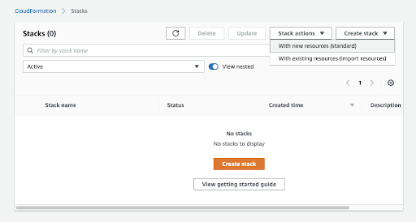

Now we need to specify the CloudFormation template/script which will be used to create the CloudFormation stack. Leave the default selections of ‘Template is ready’ and Template source of ‘Amazon S3 URL’.

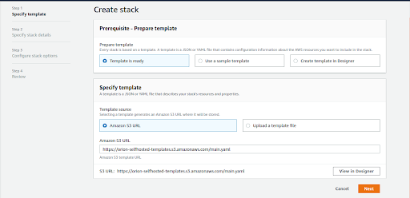

In the section for the Amazon S3 URL, enter the value:

    https://orion-ptt-system.s3.amazonaws.com/orion-ptt-system.yaml

Then click the Next button on the bottom right of the screen.

Now we need to specify details of your stack. Many of the values will be auto-populated. Please do not change the default values unless directed.

The values that need to be provided are:

* **Stack Name**: A unique name for the Stack

* **AmiId**: ID of an AMI image for EC2 Instance.  Orion Labs recommends Ubuntu 18.04 LTS.  New versions are released all the time by Canonical.  You will need to look up the current version.

* **CreateDNS**: Whether or not to create DNS records automatically using Amazon Route53.  Defaults to 'false'.  (Requires a hosted zone in Route53.)

* **CreateDNSDomain**: The domain name under which to create records.  Records created are of the form `<service name>.<domain>`.   (Required if CreateDNS is set to 'true'.  Ignored otherwise.)

* **CreateDNSZoneID**:  Hosted Zone ID from Route53 Console.  (Required if CreateDNS is set to 'true'.  Ignored otherwise.)

* **CreateVPC**: Whether or not to create a full VPC for the stack.  Defaults to 'false'.

* **CreateVPCAvailabilityZone**: AWS Availability zone for created VPC.  Defaults to 'us-east-1a'.  Ignored if CreateVPC is set to 'true'.

* **CreateVPCName**: Name of created VPC.  Ignored if CreateVPC is set to 'true'.

* **CreateVPCNetwork**: Network CIDR block for VPC.  Ignored if CreateVPC is set to 'true'.

* **CreateVPCSubnetCidrBlock**:  CIDR block for subnet.  Must be within CreateVPCNetwork set above.  Ignored if CreateVPC is set to 'true'.

* **ExistingPublicSubnet**: Public Subnet ID if using an existing subnet.  Ignored if CreateVPC is set to 'true'.

* **ExistingVpcID** ID of the VPC into which your EC2 instances will be launched.  Ignored if CreateVPC is set to 'true'.

* **InstanceName**: Name for the EC2 Host.  Defaults to ‘orion-ptt-system’.

* **InstanceType**: Type of EC2 instance to launch.

* **KeyName**: The name of an SSH KeyPair to use for access to your kubernetes nodes.

* **Volume Size** Disk Size in Gigabytes

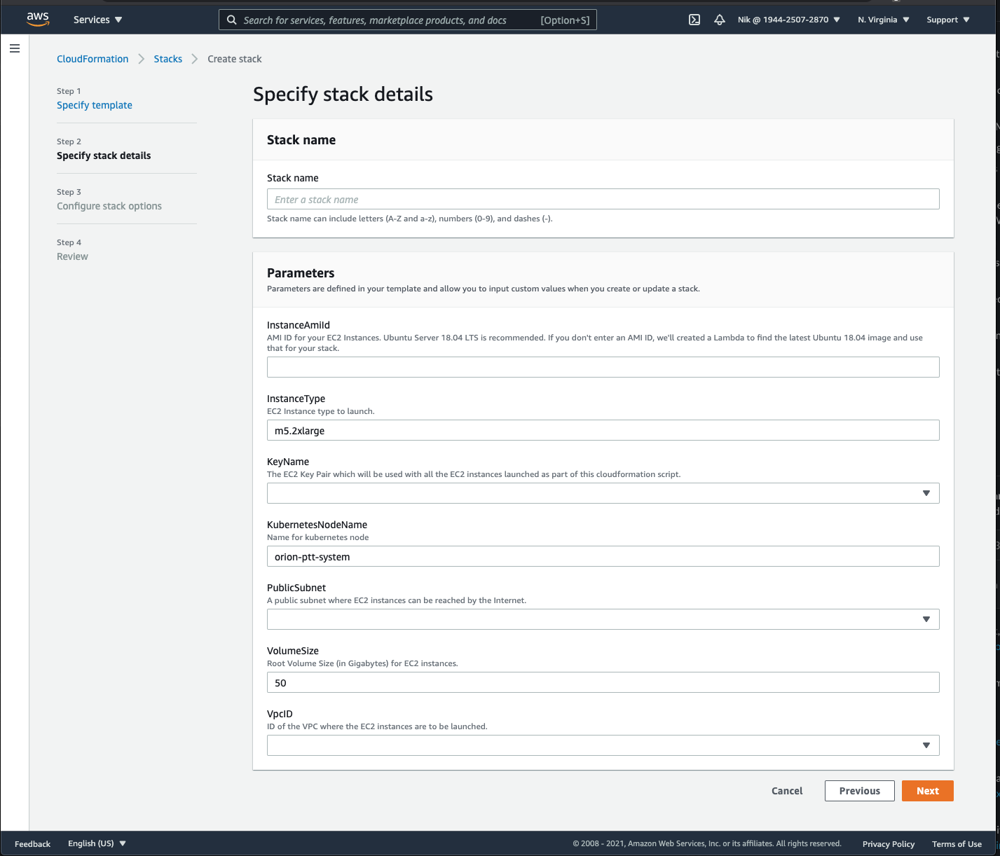

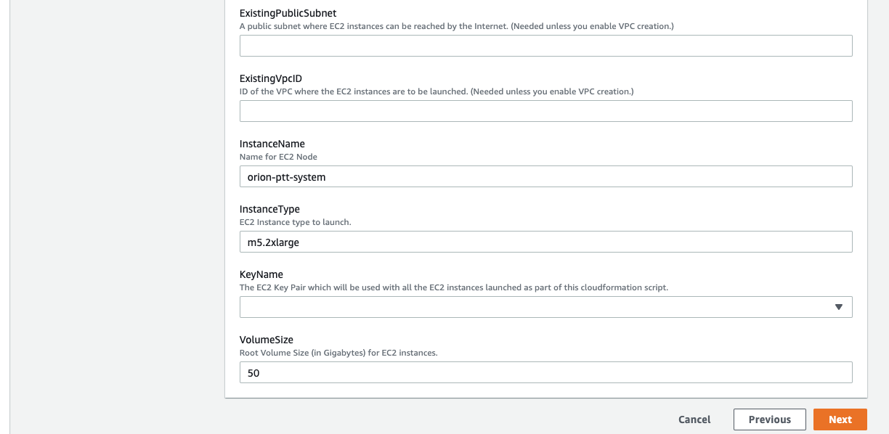

*NB: DNS Records for all services are required for the stack to function.  If you control your DNS records with Route53, and have access to a Route53 Hosted Zone, it's easiest to set CreateDNS to 'true'.  Individual customers may or may not have access to public DNS records, hence its inclusion as an optional feature.*

*NB: Likewise, customers with AWS footprints likely already have VPC resources configured.  The CreateVPC option is largely a convenience feature allowing rapid testing and evaluation.  The VPC created is sufficient to support evaluation of the Orion PTT System, but is probably not sophisticated enough to support a customer's full cloud computing operations.*

---

Next we can configure various stack options. We need to choose the IAM role we created earlier and leave everything else to default. Move to the next stage by choosing Next.

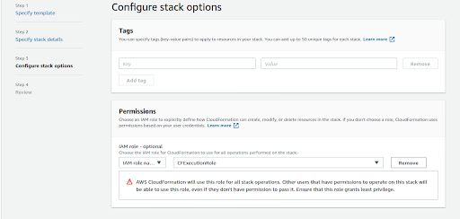

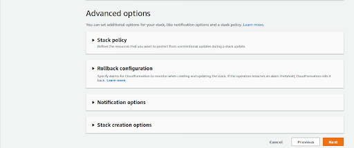

Move to the next stage by choosing Next.

Now we can review the stack before we create it, and we can review the parameter values we provided. If we need to change any values, we can use the Previous option to go back and update it.

At the end of this page we have the 'Capabilities' section, check the box to provide CloudFormation with the necessary capabilities.

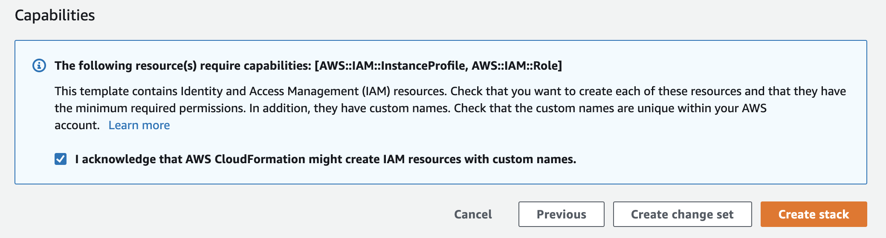

Choose Create stack to trigger creation of AWS resources.

Track the progress of the stack creation on the console. This is important because if the stack creation fails for any reason then it is automatically rolled back. Observing the progress will help in knowing when and where the error occurs.

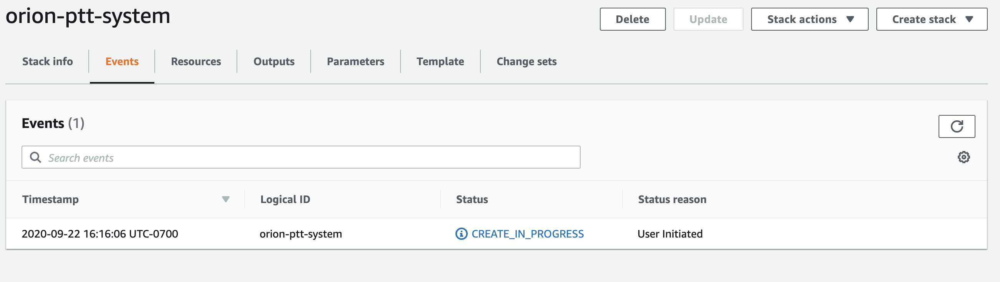

Stack creation should be completed within 10-15 minutes, look for the status “CREATE_COMPLETE” for the stack.

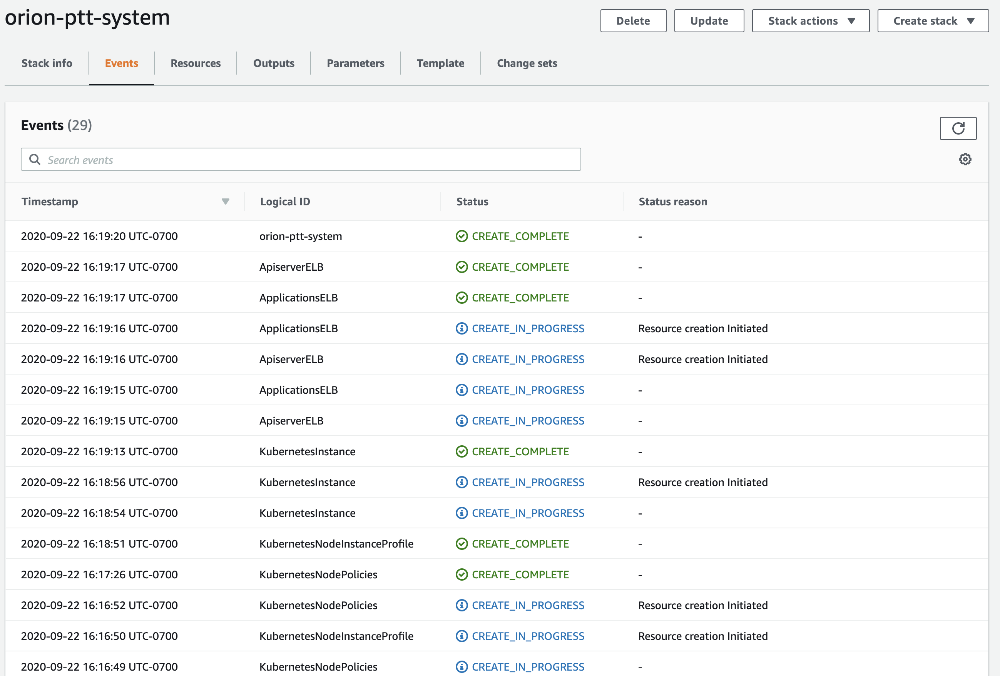

The stack should take 2-5 minutes or so to register as ‘complete’, however there are several automated tasks that cannot start until the EC2 instance is fully started and operational.

These extra steps will likely take a good 8-10 minutes after you can successfully login to the EC2 instance.

Progress can be monitored by tailing the file `/var/log/cloud-init-output.log`on the EC2 instance.

Run the following from the command line on this instance:

	tail -n 50 /var/log/cloud-init-output.log

You’ll know it’s finished when you see output similar to:

    Cloud-init v. 19.4-33-gbb4131a2-0ubuntu1~18.04.1 running 'modules:final' at Fri, 18 Sep 2020 20:16:44 +0000. Up 30.36 seconds.
    Cloud-init v. 19.4-33-gbb4131a2-0ubuntu1~18.04.1 finished at Fri, 18 Sep 2020 20:24:35 +0000. Datasource DataSourceEc2Local.  Up 501.27 seconds

## Post Installation Tasks

### Document DNS Names

The AWS-provided DNS names for the EC2 instance is exported by the cloudformation stack.

Go to the Outputs tab and note the Values for the key ‘K8sExternalIpAddress’

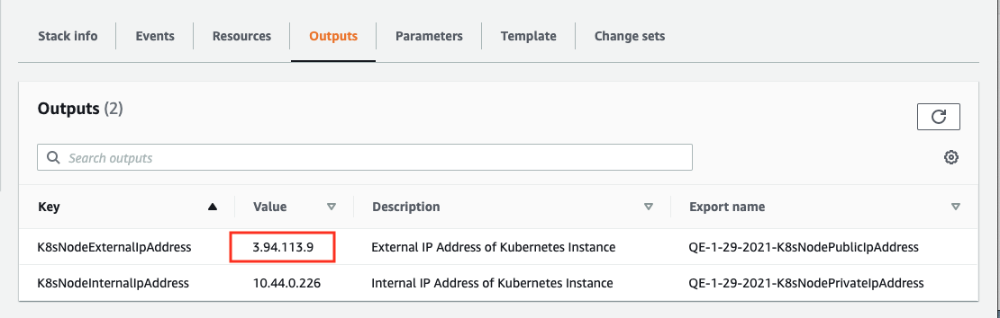

### Cloudformation DNS

The Cloudformation yaml at [https://orion-ptt-system.s3.amazonaws.com/orion-ptt-system.yaml](https://orion-ptt-system.s3.amazonaws.com/orion-ptt-system.yaml) does not handle DNS records by default. You will need to set CreateDNS to 'true', set up DNS manually, or use the above code in your own cloudformation code.
